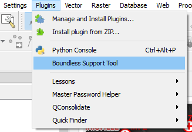
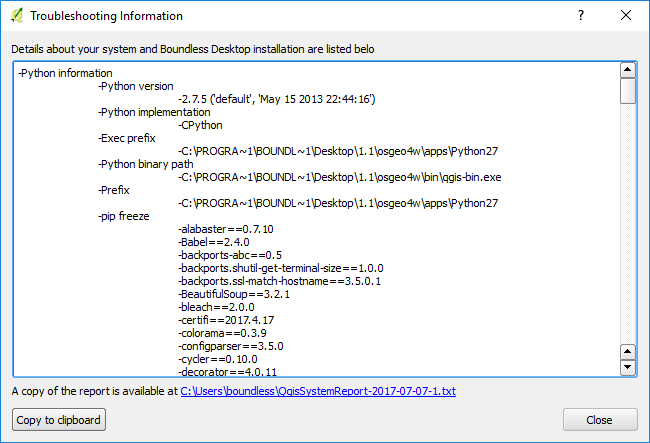

.. (c) 2016 Boundless, http://boundlessgeo.com
   This code is licensed under the GPL 2.0 license.

.. _usage:

Usage
=====

Using the |current_plugin|, you can create a report in two ways:

* Using QGIS's interface.
* Using the command shell.

Using QGIS's interface
----------------------

In QGIS, to use the |current_plugin|, click the :menuselection:`Help -->
Troubleshooting Information` menu itme.

After a few seconds, the :guilabel:`Troubleshooting Information` dialog
opens, already displaying all information that was collected.

The report is saved automatically in your file system, in the
``[your_user_folder]/.qgis2/reports`` folder. You can open it with the
default text editor by clicking the provided link.

You can also copy the full report by clicking the :guilabel:`Copy to clipboard`
button.

Using the command shell
-----------------------

The |current_plugin| plugin for QGIS uses a Python library to collect the needed
information for the report. This library can be called from outside of QGIS,
so you can obtain the same information even if your QGIS installation is
broken and QGIS itself cannot be started.

To run the report tool library, do the following:

#. From Boundless Desktop folder open the Console Shell.

   .. figure:: img/open_commnad_shell.png

#. Move to the folder where you have the installed the plugin (usually
   [your_user_folder]/.qgis2/python/plugin/reportingtool).. figure:: img/

   On Windows, type::

     cd %userprofile%\.qgis2\python\plugins\reportingtool

   On Mac OX or Linux, type::

     cd ~/.qgis2/python/plugins/reporttingtool

#. The, run the following command::

     python createreport.py

That will create a new report in the reports folder
(``[your_user_folder]/.qgis2/reports``), just like the plugin does when used
from inside QGIS.